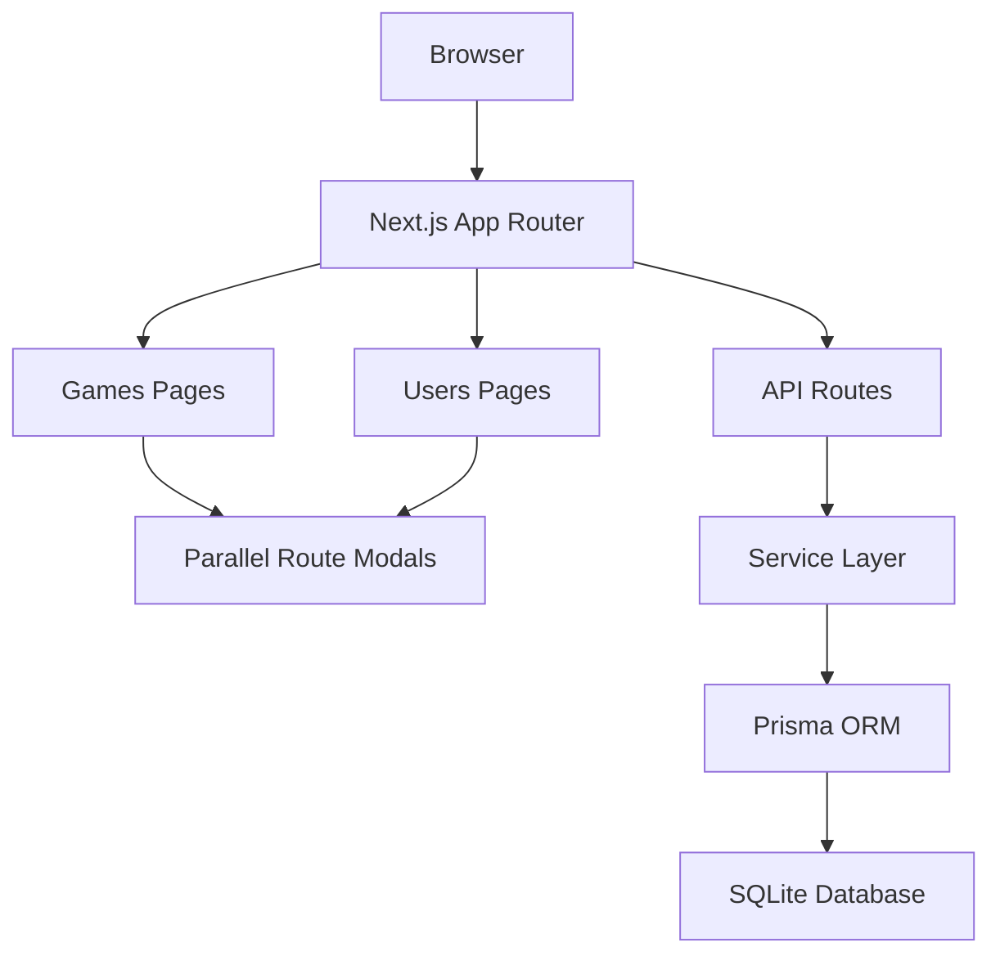

# Collection Manager

A full-stack web app for managing your game library and user profiles. Built because I wanted to get my hands dirty with Next.js 16's new features and actually understand how server components, parallel routes, and all that jazz work together.

**Tech:** Next.js 16 • React 19 • Prisma • SQLite • TypeScript • Tailwind CSS

---

## What It Does

This is a CRUD app with two main sections: games and users. Nothing fancy, but it covers the fundamentals pretty well.

**Games side:**
- Browse your game collection in a grid
- Add new games (name, cover image, genre, release date)
- Edit game details when you inevitably typo something
- Delete games you don't want anymore
- Quick preview modals using Next.js intercepting routes

**Users side:**
- View user profiles in cards
- Create and edit user accounts
- Delete users
- Same modal preview system as games

The interesting part (at least for me) was combining API routes with server actions. Some people say pick one or the other, but in real projects you'll probably use both, so I did too.

---

## How It's Built

### The Flow

Your browser hits the Next.js app router, which serves up server components for the main pages. When you click on a game or user, intercepting routes catch that navigation and show a modal instead. All the data operations go through a service layer that talks to Prisma, which handles the SQLite database.



### Route Setup

The routing uses Next.js 16's pattern for modals and overlays:

```
/games
├── /games/new              # Add a game
├── /games/[id]             # View game details
├── /games/[id]/edit        # Edit a game
└── @modal/(.)[id]          # Modal overlay (intercepting route)

/users
├── /users/new              # Add a user
├── /users/[uuid]           # View user profile
├── /users/[uuid]/edit      # Edit user
└── @modal/(.)[uuid]        # Modal overlay (intercepting route)
```

---

## Project Layout

```
collection-manager/
├── prisma/
│   └── schema.prisma          # Database models
├── src/
│   ├── actions/               # Server actions for mutations
│   ├── app/
│   │   ├── api/               # REST endpoints
│   │   │   ├── games/
│   │   │   └── users/
│   │   ├── games/
│   │   │   ├── @modal/        # Modal slot
│   │   │   ├── [id]/
│   │   │   └── new/
│   │   └── users/
│   │       ├── @modal/        # Modal slot
│   │       ├── [uuid]/
│   │       └── new/
│   ├── components/            # Shared UI components
│   ├── services/              # Database logic
│   └── utils/
└── lib/
    └── prisma.ts              # Prisma client singleton
```

---

## Database Schema

Pretty straightforward. Games have auto-incrementing IDs, users get UUIDs.

```prisma
model Game {
  id          Int      @id @default(autoincrement())
  name        String
  image       String
  genre       String
  releaseDate DateTime
  createdAt   DateTime @default(now())
  updatedAt   DateTime @updatedAt
}

model User {
  id          String   @id @default(uuid())
  name        String
  description String
  image       String
  createdAt   DateTime @default(now())
  updatedAt   DateTime @updatedAt
}
```

---

## Running This Thing

**You'll need:**
- Node.js 18 or higher
- npm, yarn, or whatever package manager you prefer

**Setup:**

```bash
# Clone it
git clone https://github.com/denver2714/collection-manager.git
cd collection-manager

# Install packages
npm install

# Create .env file with this line:
# DATABASE_URL="file:./dev.db"

# Set up the database
npx prisma generate
npx prisma db push

# Start the dev server
npm run dev
```

Then open http://localhost:3000 in your browser.

---

## Why I Built This

I wanted to practice full-stack development with modern Next.js patterns. The app router, server components, server actions, and all the new routing features felt confusing at first, so I made something simple enough to understand but complete enough to be useful.

The parallel routes for modals were the trickiest part to wrap my head around, but once you see it working, it makes sense. Same with mixing API routes and server actions—some tutorials tell you to only use one approach, but in practice you'll probably need both depending on the situation.

---

**Built with Next.js and a lot of documentation reading.**
