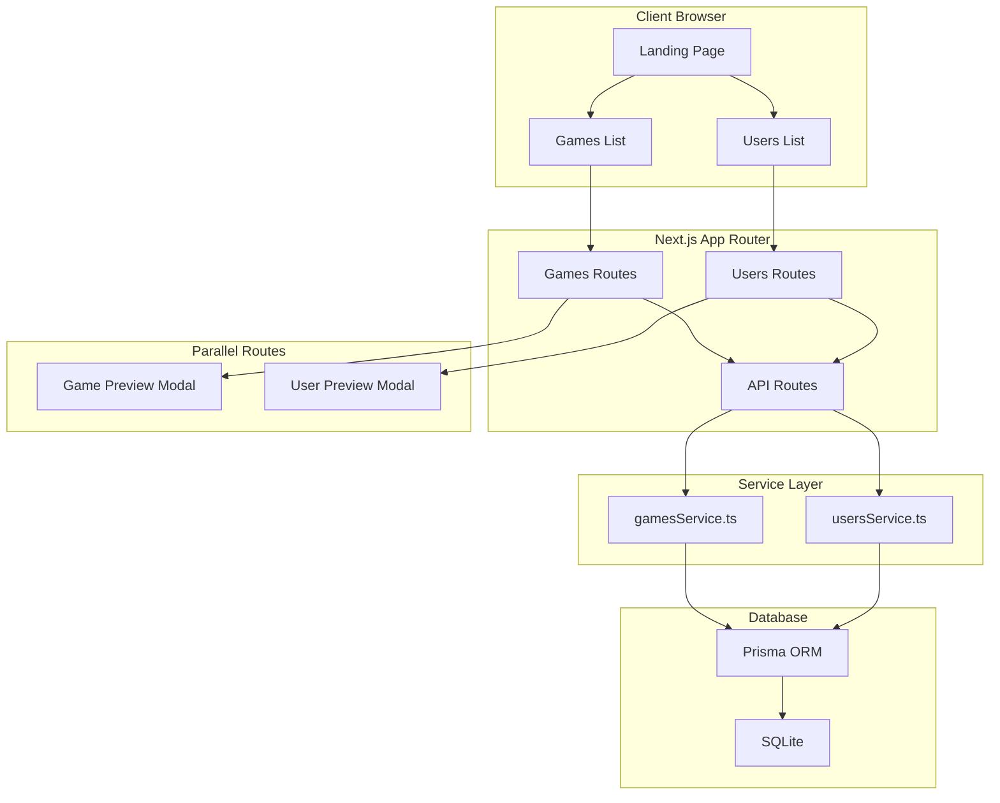

🛜 A full-stack web CRUD application for managing collections of games and users. Built with **Next.js 16**, **React 19**, and **Prisma** with SQLite.

> I made this project to practice CRUD full-stack development. I combined API routes and server actions because these are industry standard practices, it was fun and I learned alot as well documentation reading, will be doing fullstack projects again.


---

## Features

### Games Management

- View all games in a responsive grid layout
- Add new games with name, image, genre, and release date
- Edit existing game details
- Delete games
- Quick preview with intercepting modal routes

### Users Management

- View all users with profile cards
- Create new user profiles
- Edit user information
- Delete users
- Quick preview with intercepting modal routes

### Technical Highlights

- **Server Components** for optimal performance
- **Parallel Routes** for modal overlays
- **Intercepting Routes** for seamless navigation
- **shadcn/ui Components** for a clean, professional UI
- **Responsive Design** with Tailwind CSS
- **SQLite Database** with Prisma ORM

---

## Architecture

### Application Flow



### Route Structure


---

## Project Structure

```
collection-manager/
├── prisma/
│   └── schema.prisma        # Database schema
├── src/
│   ├── actions/             # Server Actions
│   ├── app/
│   │   ├── api/             # API Routes
│   │   │   ├── games/       # Games CRUD endpoints
│   │   │   └── users/       # Users CRUD endpoints
│   │   ├── games/
│   │   │   ├── @modal/      # Parallel route for modals
│   │   │   │   ├── (.)[id]/ # Intercepting route
│   │   │   │   └── (.)new/  # New game modal slot
│   │   │   ├── [id]/        # Game detail & edit
│   │   │   └── new/         # New game form
│   │   └── users/
│   │       ├── @modal/      # Parallel route for modals
│   │       │   ├── (.)[uuid]/ # Intercepting route
│   │       │   └── (.)new/  # New user modal slot
│   │       ├── [uuid]/      # User detail & edit
│   │       └── new/         # New user form
│   ├── components/          # Reusable UI components
│   ├── services/            # Database service layer
│   └── utils/               # Utility functions
├── lib/
│   └── prisma.ts            # Prisma client instance
└── generated/
    └── prisma/              # Generated Prisma client
```

---

## Tech Stack

| Category            | Technology                  |
| ------------------- | --------------------------- |
| **Framework**       | Next.js 16.1.1 (App Router) |
| **Frontend**        | React 19.2.3                |
| **Styling**         | Tailwind CSS 4.x            |
| **Language**        | TypeScript 5.x              |
| **Database**        | SQLite                      |
| **ORM**             | Prisma 7.2.0                |
| **Forms**           | React Hook Form 7.70        |
| **Icons**           | React Icons 5.5             |
| **Date Formatting** | date-fns 4.1                |

---

## Database Schema

```prisma
model Game {
  id          Int      @id @default(autoincrement())
  name        String
  image       String
  genre       String
  releaseDate DateTime
  createdAt   DateTime @default(now())
  updatedAt   DateTime @updatedAt
}

model User {
  id          String   @id @default(uuid())
  name        String
  description String
  image       String
  createdAt   DateTime @default(now())
  updatedAt   DateTime @updatedAt
}
```

---

## Getting Started

### Prerequisites

- Node.js 18+
- npm or yarn

### Installation

1. **Clone the repository**

   ```bash
   git clone https://github.com/denver2714/collection-manager.git
   cd collection-manager
   ```

2. **Install dependencies**

   ```bash
   npm install
   ```

3. **Set up environment variables**

   Create a `.env` file in the root directory:

   ```env
   DATABASE_URL="file:./dev.db"
   ```

4. **Initialize the database**

   ```bash
   npx prisma generate
   npx prisma db push
   ```

5. **Run the development server**

   ```bash
   npm run dev
   ```

6. **Open your browser**

   Navigate to [http://localhost:3000](http://localhost:3000)

---

<p align="center">
  Built with NextJS❤️
</p>
