# 🎮 Collection Manager

A modern full-stack web application for managing games and users collections, built with **Next.js 16**, **React 19**, and **Prisma** with SQLite.

> 📚 _This project was created to practice and demonstrate full-stack development skills with the latest Next.js features._


---

## ✨ Features

### Games Management

- 📋 View all games in a responsive grid layout
- ➕ Add new games with name, image, genre, and release date
- ✏️ Edit existing game details
- 🗑️ Delete games
- 🔍 Quick preview with intercepting modal routes

### Users Management

- 👥 View all users with profile cards
- ➕ Create new user profiles
- ✏️ Edit user information
- 🗑️ Delete users
- 🔍 Quick preview with intercepting modal routes

### Technical Highlights

- ⚡ **Server Components** for optimal performance
- 🚀 **Parallel Routes** for modal overlays
- 🔀 **Intercepting Routes** for seamless navigation
- 📱 **Responsive Design** with Tailwind CSS
- 🗃️ **SQLite Database** with Prisma ORM
- 🎨 **Modern UI** with smooth transitions

---

## 🏗️ Architecture

### Application Flow

```mermaid
flowchart TB
    subgraph Client["🌐 Client Browser"]
        Landing["🏠 Landing Page"]
        GamesPage["🎮 Games List"]
        UsersPage["👥 Users List"]
    end

    subgraph Routes["📂 Next.js App Router"]
        direction TB
        GamesRoutes["Games Routes"]
        UsersRoutes["Users Routes"]
        API["API Routes"]
    end

    subgraph Modal["🪟 Parallel Routes (@modal)"]
        GameModal["Game Preview Modal"]
        UserModal["User Preview Modal"]
    end

    subgraph Services["⚙️ Service Layer"]
        GamesService["gamesService.ts"]
        UsersService["usersService.ts"]
    end

    subgraph Database["🗃️ Database"]
        Prisma["Prisma ORM"]
        SQLite["SQLite Database"]
    end

    Landing --> GamesPage
    Landing --> UsersPage

    GamesPage --> GamesRoutes
    UsersPage --> UsersRoutes

    GamesRoutes --> GameModal
    UsersRoutes --> UserModal

    GamesRoutes --> API
    UsersRoutes --> API

    API --> GamesService
    API --> UsersService

    GamesService --> Prisma
    UsersService --> Prisma

    Prisma --> SQLite
```



### Route Structure

```mermaid
flowchart LR
    subgraph Games["🎮 /games"]
        G1["/games"] --> G2["/games/new"]
        G1 --> G3["/games/[id]"]
        G3 --> G4["/games/[id]/edit"]
        G1 -.->|intercept| GM["@modal/(.)[id]"]
    end

    subgraph Users["👥 /users"]
        U1["/users"] --> U2["/users/new"]
        U1 --> U3["/users/[uuid]"]
        U3 --> U4["/users/[uuid]/edit"]
        U1 -.->|intercept| UM["@modal/(.)[uuid]"]
    end
```



---

## 📁 Project Structure

```
collection-manager/
├── prisma/
│   └── schema.prisma        # Database schema
├── src/
│   ├── actions/             # Server Actions
│   ├── app/
│   │   ├── api/             # API Routes
│   │   │   ├── games/       # Games CRUD endpoints
│   │   │   └── users/       # Users CRUD endpoints
│   │   ├── games/
│   │   │   ├── @modal/      # Parallel route for modals
│   │   │   │   ├── (.)[id]/ # Intercepting route
│   │   │   │   └── (.)new/  # New game modal slot
│   │   │   ├── [id]/        # Game detail & edit
│   │   │   └── new/         # New game form
│   │   └── users/
│   │       ├── @modal/      # Parallel route for modals
│   │       │   ├── (.)[uuid]/ # Intercepting route
│   │       │   └── (.)new/  # New user modal slot
│   │       ├── [uuid]/      # User detail & edit
│   │       └── new/         # New user form
│   ├── components/          # Reusable UI components
│   ├── services/            # Database service layer
│   └── utils/               # Utility functions
├── lib/
│   └── prisma.ts            # Prisma client instance
└── generated/
    └── prisma/              # Generated Prisma client
```

---

## 🛠️ Tech Stack

| Category            | Technology                  |
| ------------------- | --------------------------- |
| **Framework**       | Next.js 16.1.1 (App Router) |
| **Frontend**        | React 19.2.3                |
| **Styling**         | Tailwind CSS 4.x            |
| **Language**        | TypeScript 5.x              |
| **Database**        | SQLite                      |
| **ORM**             | Prisma 7.2.0                |
| **Forms**           | React Hook Form 7.70        |
| **Icons**           | React Icons 5.5             |
| **Date Formatting** | date-fns 4.1                |

---

## 📊 Database Schema

```prisma
model Game {
  id          Int      @id @default(autoincrement())
  name        String
  image       String
  genre       String
  releaseDate DateTime
  createdAt   DateTime @default(now())
  updatedAt   DateTime @updatedAt
}

model User {
  id          String   @id @default(uuid())
  name        String
  description String
  image       String
  createdAt   DateTime @default(now())
  updatedAt   DateTime @updatedAt
}
```

---

## 🚀 Getting Started

### Prerequisites

- Node.js 18+
- npm or yarn

### Installation

1. **Clone the repository**

   ```bash
   git clone https://github.com/yourusername/collection-manager.git
   cd collection-manager
   ```

2. **Install dependencies**

   ```bash
   npm install
   ```

3. **Set up environment variables**

   Create a `.env` file in the root directory:

   ```env
   DATABASE_URL="file:./dev.db"
   ```

4. **Initialize the database**

   ```bash
   npx prisma generate
   npx prisma db push
   ```

5. **Run the development server**

   ```bash
   npm run dev
   ```

6. **Open your browser**

   Navigate to [http://localhost:3000](http://localhost:3000)

---

## 📜 Available Scripts

| Command              | Description                             |
| -------------------- | --------------------------------------- |
| `npm run dev`        | Start development server with Turbopack |
| `npm run build`      | Build for production                    |
| `npm run start`      | Start production server                 |
| `npm run lint`       | Run ESLint                              |
| `npx prisma studio`  | Open Prisma database GUI                |
| `npx prisma db push` | Push schema changes to database         |

---

## 🔮 Roadmap

- [ ] User authentication
- [ ] Image upload functionality
- [ ] Search and filtering
- [ ] Pagination
- [ ] Dark mode toggle
- [ ] Unit & integration tests
- [ ] API rate limiting
- [ ] Export/Import data

---

## 📝 License

This project is for educational purposes.

---

<p align="center">
  Made with ❤️ using Next.js
</p>
